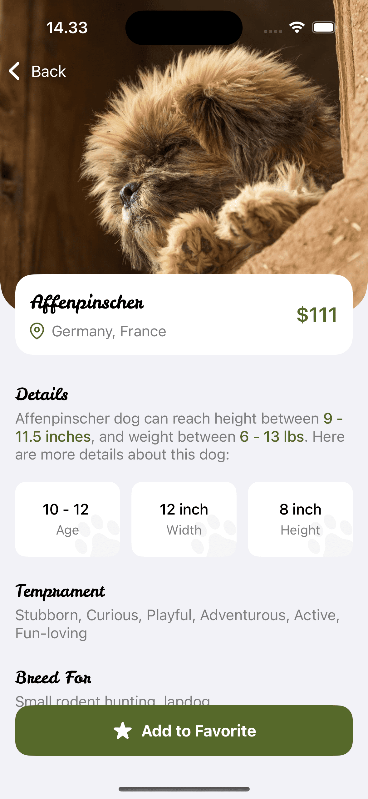
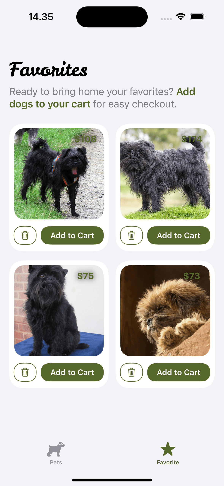

# Paw Shop App
A simple pet store iOS app built with SwiftUI that allows customers to find dogs and buy them.

## Build With
- SwiftUI
- URLSession (Used in APIService.swift)
- The Dog Api (https://thedogapi.com)
- MVVM Architecture Pattern
- Swift Concurrency (Async/Await) 

## Features 
- Log in and Sign up
- Add to Favorite
- List of Breeds and dogs with pagination and refresh feature
- Add to cart and checkout

## Technical Details 
- Login and Signup data stored in keychain (KeychainHelper.swift)
- Favorite data stored locally with UserDefaults
- TabView with two main screens, first tab shows list of breeds, second tab show list of favorites
- Dependency Injection (provide testable code)

## How to run the project
1. Generate Api Key from https://thedogapi.com
2. Add a property list (.plist) file with the name 'API-Info' and place it in the 'Supporting Files' folder
3. Add new item with 'API_KEY' as the key name, and your generated api key for the item value.
4. Build and run project

## Project Structure
    .
    ├── Pet Shop
    │   ├── App                 # App and AppDelegate files
    │   ├── Module              # Grouping files by feature
    │   │   └── Features        # Contain views, viewmodel, and validator files
    │   ├── Models              # Model files
    │   ├── Utils               # Contain all core files, such as Networking, extension, view components, helper, etc
    │   └── Supporting Files    # Contains files such as assets, mock JSON, .plist, and font files
    ├── Pet ShopTests           # Unit test files
    └── Pet ShopUITests         # UI test files
    
## Demo
| Log in | Sign Up | 
| :---------: | :---------: |
|  |  |

| List Breeds | List Pets  | Pet Detail |
| :---------: | :---------: | :---------: |
|  |  |  |

| List Favorites | Checkout | 
| :---------: | :---------: |
|  |  |
